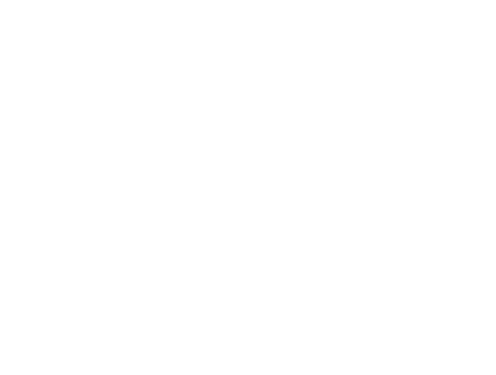
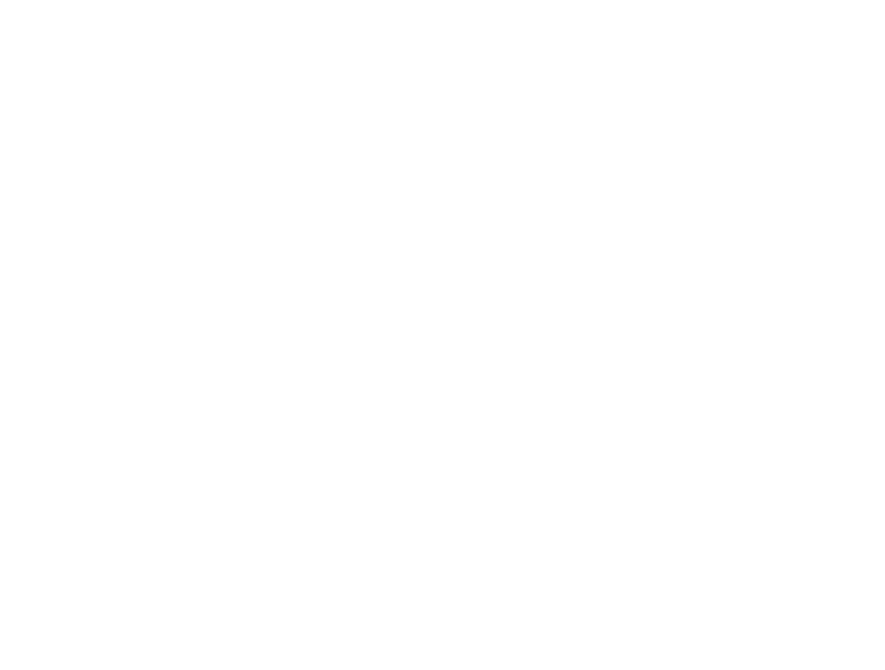
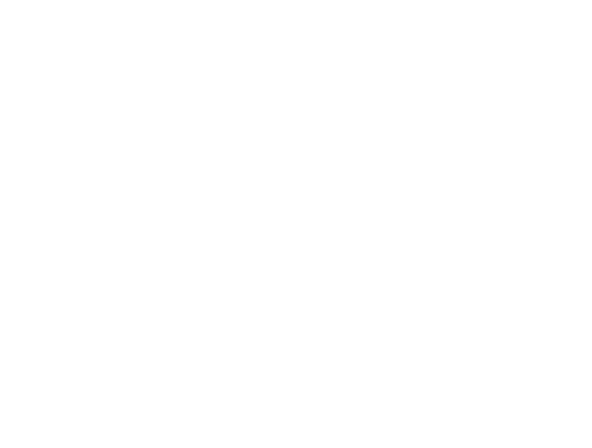

# Customer Churn Prediction

Predicting customer churn using machine learning techniques to help businesses identify customers who are likely to discontinue their services and take proactive retention measures.

---

## Project Overview

Customer churn is one of the major challenges faced by subscription-based businesses such as telecom companies, banks, and SaaS platforms. Losing existing customers directly impacts revenue and increases acquisition costs.

The objective of this project is to build a machine learning model that predicts whether a customer will churn based on demographic information, account details, subscribed services, and billing information.

The project includes:

- Exploratory Data Analysis (EDA)
- Data preprocessing
- Feature engineering
- Classification model building
- Model evaluation
- Business insights and recommendations

---

## Problem Statement

Predict whether a customer will churn using historical customer information.

Target Variable:

- **0 → Customer stays**
- **1 → Customer churns**

This is a **binary classification problem**.

---

## Dataset

**Dataset:** Telco Customer Churn Dataset

The dataset contains customer demographics, account information, services subscribed, and billing details.

### Features

- Gender
- Senior Citizen
- Partner
- Dependents
- Tenure
- Phone Service
- Multiple Lines
- Internet Service
- Online Security
- Online Backup
- Device Protection
- Tech Support
- Streaming TV
- Streaming Movies
- Contract Type
- Paperless Billing
- Payment Method
- Monthly Charges
- Total Charges
- Churn (Target)

---

## Project Workflow

```
Business Understanding
        ↓
Data Collection
        ↓
Data Cleaning
        ↓
Exploratory Data Analysis
        ↓
Feature Engineering
        ↓
Train-Test Split
        ↓
Model Building
        ↓
Model Evaluation
        ↓
Business Insights
```

---

## Exploratory Data Analysis

The following visualizations were used:

### Churn Distribution



### Correlation Heatmap



### Confusion Matrix



---

## Key EDA Observations

The exploratory data analysis revealed several important patterns associated with customer churn:

- Customers on **month-to-month contracts** had the highest churn rates, while customers with one-year and two-year contracts were more likely to stay.

- Customers with **shorter tenure** were significantly more likely to churn, indicating that the first few months of the customer lifecycle are critical for retention.

- Customers with **higher monthly charges** showed a greater tendency to churn, suggesting that pricing and perceived service value influence customer decisions.

- Customers with **higher total charges** were less likely to churn, reflecting the loyalty of long-term customers.

- **Fiber optic internet users** exhibited higher churn compared to DSL users and customers without internet service.

- Customers without **Online Security** and **Tech Support** services were much more likely to churn, indicating that value-added services improve customer retention.

- Customers using **Electronic Check** as their payment method had the highest churn rates, whereas customers using automatic payment methods were more likely to remain with the company.

- **Senior citizens** showed relatively higher churn rates compared to non-senior customers.

- Customers with **partners and dependents** tended to stay longer and exhibited lower churn rates.

- **Gender and Phone Service** did not show a strong relationship with churn, suggesting that these features have limited predictive power.

---

## Data Preprocessing

The following preprocessing steps were performed:

- Converted `TotalCharges` from object to numeric.
- Handled missing values.
- Removed the `customerID` column.
- Encoded categorical variables using one-hot encoding.
- Performed train-test split using stratification.
- Applied feature scaling where necessary.

---

## Models Used

### 1. Logistic Regression

- Simple and interpretable baseline model.
- Suitable for binary classification.

### 2. Random Forest

- Ensemble learning method.
- Captures nonlinear relationships.
- Provides feature importance.

### 3. XGBoost

- Gradient boosting algorithm.
- Handles complex patterns efficiently.
- Achieved the best overall performance.

---

## Model Performance (XGBoost)

| Metric | Score |
|----------|---------|
| Accuracy | 76.47% |
| Precision | 56.00% |
| Recall | 50.53% |
| F1-Score | 53.00% |
| ROC-AUC | 0.804 |

### Confusion Matrix

| Actual / Predicted | No Churn | Churn |
|--------------------|-----------|--------|
| No Churn | 887 | 146 |
| Churn | 185 | 189 |

---

## Evaluation Metrics

The following metrics were used to evaluate the models:

### Accuracy

Measures the proportion of correctly classified instances.

### Precision

Measures how many predicted churners actually churned.

### Recall

Measures how many actual churners were correctly identified.

### F1-Score

Balances precision and recall.

### ROC-AUC

Evaluates the model's ability to distinguish between churners and non-churners.

---

## Business Insights

Based on the analysis, businesses can reduce churn by:

- Encouraging customers to switch from month-to-month contracts to long-term contracts.
- Improving onboarding experiences for new customers.
- Providing incentives for high-risk customers.
- Promoting Online Security and Tech Support services.
- Encouraging automatic payment methods.
- Monitoring fiber optic customers more closely.

---

## Technologies Used

- Python
- Pandas
- NumPy
- Matplotlib
- Seaborn
- Scikit-learn
- XGBoost
- Jupyter Notebook

---

## Project Structure

```
Customer-Churn-Prediction/
│
├── customer_churn_prediction.ipynb
├── Telco-Customer-Churn.csv
├── README.md
├── requirements.txt
│
├── plots/
│   ├── churn_distribution.png
│   ├── correlation_heatmap.png
│   └── confusion_matrix.png
│
└── .gitignore
```

---

## Installation

Clone the repository:

```bash
git clone https://github.com/<your-github-username>/Customer-Churn-Prediction.git
```

Move into the project directory:

```bash
cd Customer-Churn-Prediction
```

Install dependencies:

```bash
pip install -r requirements.txt
```

Launch Jupyter Notebook:

```bash
jupyter notebook
```

Open:

```
churn_prediction.ipynb
```

---

## Future Improvements

Potential enhancements include:

- Hyperparameter tuning using GridSearchCV or RandomizedSearchCV.
- Handling class imbalance using SMOTE.
- Threshold optimization to improve recall.
- Model explainability using SHAP values.
- Deploying the model using Flask or Streamlit.
- Real-time churn prediction dashboard.

---

## Conclusion

This project demonstrates an end-to-end machine learning workflow for customer churn prediction. The analysis identified important factors influencing churn and built predictive models capable of distinguishing churners from non-churners with good performance.

The findings highlight that customer engagement, service quality, pricing, and contract commitment play a greater role in churn than demographic characteristics. These insights can help businesses implement targeted retention strategies and improve customer satisfaction.

---

